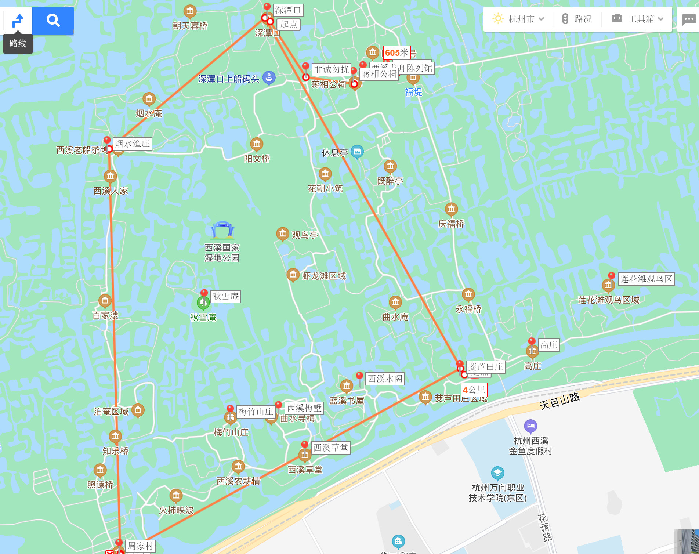

# 杭州

## 西湖

茅家埠（bù） 赏日落

御鹄湾

秋天： 

* 北山路：赏梧桐
* 杨公堤
* 龙井路：枫香、无患子
* 灵隐路：枫叶
* 曙光路

### 参考

1. 西湖什么时候最美？在什么季节？最佳的观景地点在哪里？

   https://www.zhihu.com/question/26510246/answer/33431897

2. 西湖一日游线路有哪些建议

   https://www.zhihu.com/question/19834881/answer/211720257

## 西溪湿地公园

### 游船路线

周家村 —— 烟水渔庄 —— 深潭口 —— 茭芦田庄 —— 周家村

概览图

* 周家村

  西门进入西溪，游客中心的白墙拍照

  

  坐船去烟水渔庄

* 烟水渔庄

  * 参观桑蚕丝绸故事馆
    * 参观从蚕丝到丝绸的生产全过程
    * 和桑蚕雕塑派和合影
  * 参观下婚俗馆
    * 看看当地的婚俗礼节
  * 西溪人家
    * 西溪大字 拍照
  * 坐船到深潭口

* 深潭口

  

  * 非诚勿扰宣言墙
  * 蒋相公祠
  * 西溪龙舟陈列馆
  * 河渚街区
  * 河渚街
  * 坐船到茭芦田庄

* 茭芦田庄

  * 高庄
    * 拱门拍照
    * 拍亭子
  * 莲花滩观鸟区
  * 坐船到周家村

* 周家村

  * 梅竹山庄

  * 西溪草堂

  * 西溪梅墅

  * 西溪水阁

    

### 其他景点

跟游船没连在一起，有时间可以去的景点

* 洪园
* 东关荷塘

### 参考

https://www.zhihu.com/question/36924977/answer/615590381

